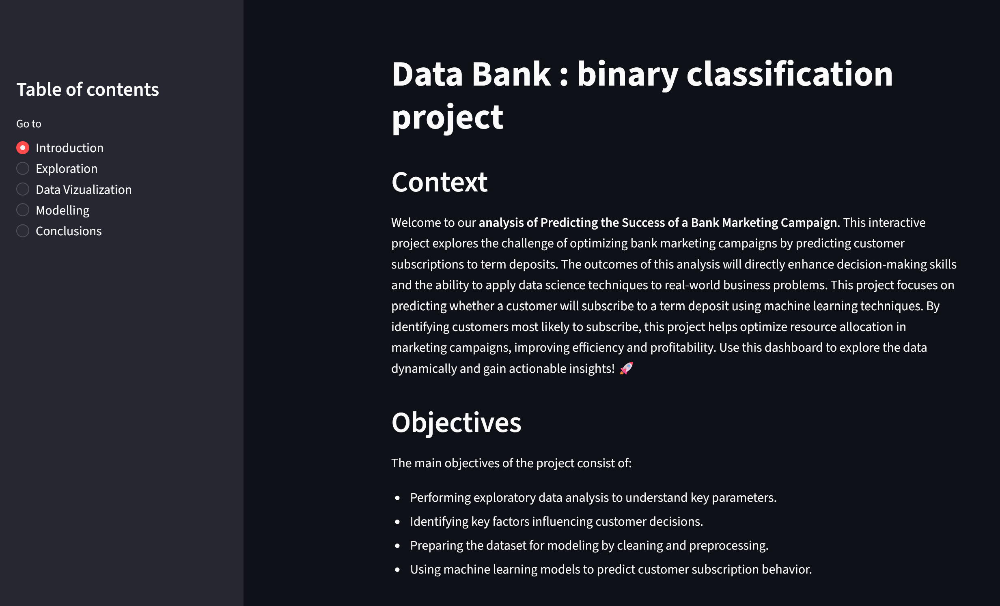

# Bank Marketing Campaign Prediction

## Overview
This project analyzes customer-level data from a bank marketing campaign to predict whether a client will subscribe to a term deposit. The goal is to support more efficient targeting in marketing campaigns.

## Tools
- Python (pandas, scikit-learn)
- Streamlit

## Methods
- Exploratory Data Analysis (EDA)
- Logistic Regression
- Decision Trees
- Handling class imbalance (resampling techniques)
- Model evaluation (precision, recall)

## Results
- Achieved a precision score of **0.70** for the target class (subscribed customers)
- Identified key predictors such as:
  - Contact duration
  - Contact frequency
  - Employment status

## Demo
👉 [Live Streamlit App](https://app-app-ee6kfvjxjadfghymbbzhes.streamlit.app/)

## Screenshot
Streamlit dashboard preview:

## Key Takeaways
- Demonstrates ability to work with structured customer data
- Applies machine learning to a real business problem
- Focuses on interpretability and actionable insights
